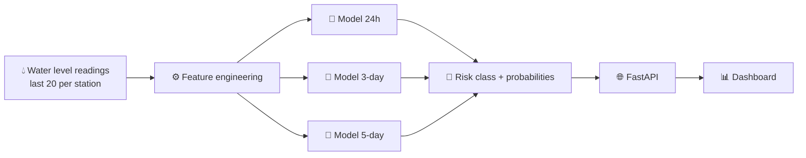

<div align="center">

# 🌊 Kosi Flood Risk Predictor

### Machine-learning early warning for the Kosi River basin

Predicts flood risk **24 hours, 3 days and 5 days ahead** for five river gauge stations, served through a FastAPI backend and a live dashboard.

<br>

[](https://kosi-flood-predictor.fastapicloud.dev/)
[](https://kosi-flood-predictor.fastapicloud.dev/docs)


</div>

---

## 📸 Preview

<!-- Replace with your own screenshot: save it as docs/dashboard.png and uncomment the next line -->
<!-- <p align="center"></p> -->

> 👉 **Try it live:** [kosi-flood-predictor.fastapicloud.dev](https://kosi-flood-predictor.fastapicloud.dev/)

---

## 🎯 Why this project?

The Kosi River, often called the **"Sorrow of Bihar"**, is one of the most flood-prone rivers in India. Floods here displace thousands of people nearly every monsoon. Simple threshold alerts only warn people once the water is already high.

This project looks at **recent water-surface-elevation (WSE) trends** at each gauge station and forecasts the **flood risk level in advance**, giving communities and authorities more time to prepare.

---

## ✨ Features

| | Feature | Details |
|---|---|---|
| 🔮 | **Multi-horizon forecasts** | Separate models for **24 hours**, **3 days** and **5 days** ahead |
| 📍 | **5 monitoring stations** | Baltara · Basua · Birpur · Jainagar · Kursela |
| 📈 | **Trend-aware features** | Rate of change, rolling volatility, and distance to warning/danger levels |
| 🎚️ | **Confidence scores** | Every forecast comes with class probabilities |
| 🖥️ | **Interactive dashboard** | Live station cards and 20-reading history charts |
| ⚡ | **REST API** | Fast JSON endpoints with auto-generated Swagger docs |
| ☁️ | **Cloud deployed** | Running on FastAPI Cloud |

---

## 🏗️ How it works



### Engineered features

For each station, the latest reading is turned into model inputs:

- **`wse_change_1step / 4step / 20step`**: how fast the water level is rising or falling
- **`wse_rolling_std_4 / 20`**: short- and long-term volatility
- **`dist_to_warning_boundary`**: metres between current level and the **Warning Level**
- **`dist_to_danger_boundary`**: metres between current level and the **Danger Level**
- **Station identity** (one-hot encoded), since each station has different thresholds

Each horizon's model uses its own tuned feature set.

---

## 🔌 API Endpoints

Base URL: `https://kosi-flood-predictor.fastapicloud.dev`

| Method | Endpoint | Description |
|:---:|---|---|
| `GET` | `/` | Redirects to the dashboard |
| `GET` | `/dashboard/` | Interactive web dashboard |
| `GET` | `/stations/current` | Latest forecasts (24h / 3-day / 5-day) for all stations |
| `GET` | `/stations/{station}/history` | Last 20 readings plus danger, warning and HFL levels |
| `POST` | `/predict` | Custom prediction from your own 20 readings |
| `GET` | `/docs` | Interactive Swagger documentation |

<details>
<summary><b>📥 Example: <code>POST /predict</code></b></summary>

<br>

**Request**

```json
{
  "station": "Baltara",
  "horizon": "24h",
  "readings": [
    { "time": "2026-09-20T06:00:00", "wse": 31.42 },
    { "time": "2026-09-20T12:00:00", "wse": 31.48 }
    // ... at least 20 readings, oldest first
  ]
}
```

**Response**

```json
{
  "station": "Baltara",
  "horizon": "24h",
  "predicted_risk": "...",
  "probabilities": { "...": 0.00 }
}
```

`horizon` can be `"24h"`, `"3day"` or `"5day"`.

</details>

<details>
<summary><b>📥 Example: <code>GET /stations/current</code></b></summary>

<br>

```json
{
  "stations": [
    {
      "station": "Baltara",
      "latest_wse": 31.48,
      "latest_time": "2026-09-20T12:00:00",
      "forecasts": {
        "24h":  { "predicted_risk": "...", "confidence": 0.00 },
        "3day": { "predicted_risk": "...", "confidence": 0.00 },
        "5day": { "predicted_risk": "...", "confidence": 0.00 }
      }
    }
  ]
}
```

</details>

---

## 📂 Project Structure

```
kosi-flood-predictor/
├── backend/
│   ├── main.py              # FastAPI app: API, features, predictions
│   ├── __init__.py
│   └── static/
│       └── dashboard.html   # Frontend dashboard
├── models/                  # Trained models, feature lists, column schemas
│   ├── model_24h.pkl
│   ├── model_3day.pkl
│   └── model_5day.pkl
├── data/
│   └── processed/
│       └── resampled_stations.parquet
├── pyproject.toml           # Dependencies and FastAPI entrypoint
└── README.md
```

---

## 🚀 Run Locally

**1. Clone the repo**

```bash
git clone https://github.com/Chukunju/kosi-flood-predictor.git
cd kosi-flood-predictor
```

**2. Create and activate a virtual environment**

```bash
python -m venv .venv

# Windows
.venv\Scripts\activate

# macOS / Linux
source .venv/bin/activate
```

**3. Install dependencies**

```bash
pip install "fastapi[standard]" scikit-learn joblib numpy pandas pyarrow
```

> 💡 For identical results, use the pinned versions listed in `pyproject.toml`. Pickled models can break if the scikit-learn version differs from the one used for training.

**4. Start the server**

```bash
uvicorn backend.main:app --reload
```

**5. Open it**

| What | URL |
|---|---|
| Dashboard | http://127.0.0.1:8000/ |
| API docs | http://127.0.0.1:8000/docs |

---

## ☁️ Deployment

Deployed with **FastAPI Cloud**:

```bash
fastapi login
fastapi deploy
```

The entrypoint is set in `pyproject.toml`:

```toml
[tool.fastapi]
entrypoint = "backend.main:app"
```

---

## 🧰 Tech Stack

| Layer | Tools |
|---|---|
| **Language** | Python 3.13 |
| **Machine learning** | scikit-learn, joblib |
| **Data** | pandas, NumPy, Parquet (pyarrow) |
| **Backend** | FastAPI, Uvicorn, Pydantic |
| **Frontend** | HTML, CSS, JavaScript |
| **Hosting** | FastAPI Cloud |

---

## 🗺️ Roadmap

- [x] Train models for 24h, 3-day and 5-day horizons
- [x] REST API with probability outputs
- [x] Interactive dashboard
- [x] Cloud deployment
- [ ] Live data ingestion from gauge stations
- [ ] Rainfall and upstream-discharge features
- [ ] SMS / email alerts when risk level rises
- [ ] Model performance dashboard and monitoring

---

## ⚠️ Disclaimer

This is an **educational / research project**. Forecasts are statistical estimates and must **not** be used as the sole basis for evacuation or safety decisions. Always follow official warnings from the Central Water Commission (CWC) and local disaster management authorities.

---

## 👤 Author

**Priyanshu Prakash**
GitHub: [@Chukunju](https://github.com/Chukunju)

---

<div align="center">

**If you found this project useful, please consider giving it a ⭐**

*Built with 💙 for flood-prone communities of the Kosi basin*

</div>
